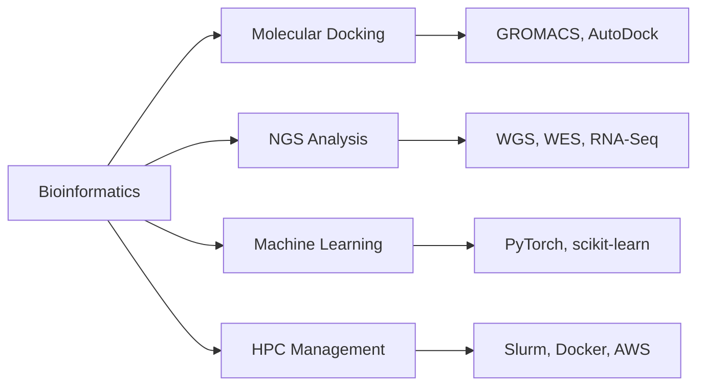
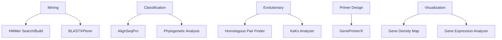

<!-- 🌟 Animated Typing Header with Color Variations -->

<!-- Banner -->

<!-- Divider -->

  
  

  <h3>Transforming Genomic Data into Biological Insights</h3>

  <!-- Replace with your banner image URL -->
  
  
  
  
  <!-- Connect Badges -->
  
  
  
  

## 👨‍🔬 About Me

I'm a passionate **Bioinformatician** at an **Evolutionary Biology Lab** specializing in computational biology and genomics. My work bridges:

- 🧬 Plant genomics & evolutionary pattern analysis
- 💊 Molecular docking simulations (GROMACS, AutoDock)
- 📊 Multi-omics data integration (WGS, WES, RNA-Seq)
- ⚙️ HPC cluster management & pipeline automation
- 🤖 Machine learning for biological predictions

> "In bioinformatics, data is the new genome, and algorithms are the tools to decode life."

---

## 🛠️ Technical Expertise

### 🔍 Core Domains

### 💻 Technologies & Tools

  
| Category          | Tools & Technologies |
|-------------------|----------------------|
| **Languages**     |    |
| **Bioinformatics**|    |
| **NGS**           |    |
| **Visualization** |    |
| **HPC & Cloud**   |    |

---

## 🌟 Featured Projects

### 🧬 Genome Wide Workbench 2.1
**Integrated genomic analysis suite with 8 specialized modules:**

<b>🔍 Key Features</b>

  
#### Mining Tab
- **HMMer Suite**: Custom sequence weighting & E-value thresholds
- **BLASTXPlorer**: Multi-BLAST type support with auto-configuration

#### Evolutionary Analysis
- **Homologous Pair Finder**: DIAMOND-based homology detection
- **KaKs Analyzer**: Automated evolutionary rate calculation

#### Visualization
- **Gene Density Maps**: Interactive chromosome visualization
- **Expression Analyzer**: Clustered heatmaps for transcriptomics

---

## 📊 GitHub Activity

  
  |  |  |
  |---|---|
  
  <!-- Customized contribution graph -->
  

---

  
  ## 📫 Let's Collaborate!
  
  
  
  
  
  

